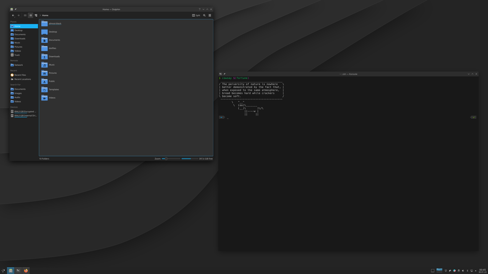

# Almost Black

A dark color scheme for KDE Plasma.

## Usage

### Color Scheme

1. Open System Settings
2. Navigate to Appearence > Colors
3. Click Install from File...
4. Select color-scheme/AlmostBlack.colors

### Konsole Theme

1. Copy konsole/AlmostBlack.colorscheme to ~/.local/share/konsole/
2. Open a **new** instance of Konsole
3. Press _Ctrl+Shift+,_
4. Under Profiles, select your current profile and press the Edit button
5. Under Appearance select "Almost Black" and click Apply

## Credits

The Konsole theme is based on Dark+ from [iTerm2-Color-Schemes](https://github.com/mbadolato/iTerm2-Color-Schemes).