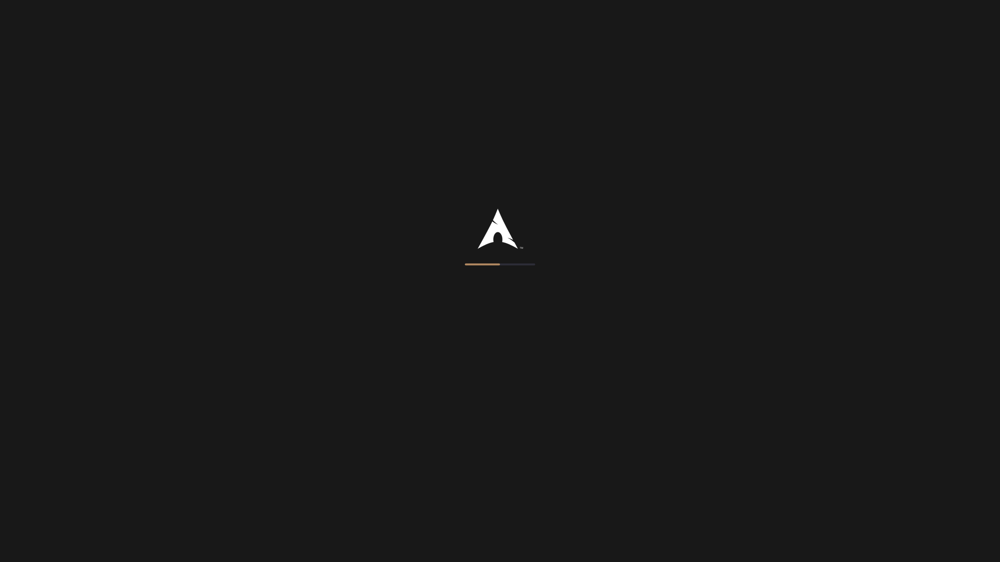

# Almost Black

A dark color scheme

## Usage

### Alacritty

Copy the content of alacritty/almost-black.toml to the color section of ~/.config/alacritty/alacritty.toml

### Plasma

1. Open System Settings
1. Navigate to Appearence > Colors
1. Click Install from File...
1. Select plasma/AlmostBlack.colors

### Konsole

1. Copy konsole/AlmostBlack.colorscheme to ~/.local/share/konsole/
1. Open a **new** instance of Konsole
1. Press _Ctrl+Shift+,_
1. Under Profiles, select your current profile and press the Edit button
1. Under Appearance select "Almost Black" and click Apply

### Rofi

1. Copy rofi/almost-black.rasi to ~/.config/rofi/
1. Add `@theme "almost-black"` to your rofi config

### Splash Screen

1. Create a new directory at ~/.local/share/plasma/look-and-feel/Almost-Black-Splash (the name actually matters here)
1. Copy the content of splash to said directory
1. Open System Settings
1. Navigate to Appearance > Splash Screen
1. Select "Almost Black" and click apply

Both the [Plasma Color Scheme](https://www.pling.com/p/1721771) and the [Konsole Color Scheme](https://www.pling.com/p/1721794) are available in the Pling Store and can also be installed via Plasma's "Get New" system.

### VSCode / VSCodium

1. Open your settings file by pressing `Ctrl+Alt+P`, typing and selecting _Preferences: Open User Settings (JSON)_.
2. Paste the inner JSON (everything except the outer curly braces) of code/almost-black.json into your config file.

## Credits

The Konsole theme is based on Dark+ from [iTerm2-Color-Schemes](https://github.com/mbadolato/iTerm2-Color-Schemes).  
The splash screen was forked from  P3tray's [1604-Arch-Splash](https://github.com/P3tray/1604-Arch-Splash).  
The ASCII art in the screenshot of console was created using [this](https://paste.xinu.at/oeP93l/plain) script from lolilolicon.  
The icon theme I use in the screenshots is the wonderful [Papirus Dark](https://github.com/PapirusDevelopmentTeam/papirus-icon-theme/).