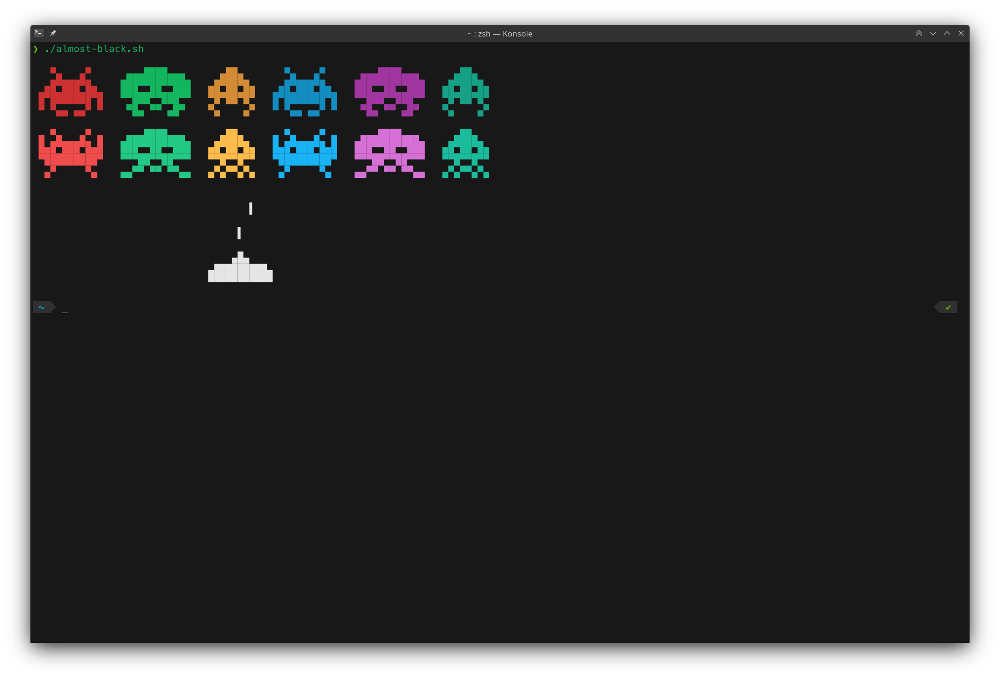

# Almost Black

A dark color scheme

 

## Usage

### Alacritty

Copy the content of alacritty/almost-black.yml to the color section of ~/.config/alacritty/alacritty.yml

### Plasma

1. Open System Settings
2. Navigate to Appearence > Colors
3. Click Install from File...
4. Select plasma/AlmostBlack.colors

### Konsole

1. Copy konsole/AlmostBlack.colorscheme to ~/.local/share/konsole/
2. Open a **new** instance of Konsole
3. Press _Ctrl+Shift+,_
4. Under Profiles, select your current profile and press the Edit button
5. Under Appearance select "Almost Black" and click Apply

Both the [Plasma Color Scheme](https://www.pling.com/p/1721771) and the [Konsole Color Scheme](https://www.pling.com/p/1721794) are available in the Pling Store and can also be installed via Plasma's "Get New" system.

## Credits

The Konsole theme is based on Dark+ from [iTerm2-Color-Schemes](https://github.com/mbadolato/iTerm2-Color-Schemes).  
The ASCII art in the screenshot of console was created using [this](https://paste.xinu.at/oeP93l/plain) script from lolilolicon.  
The icon theme I use in the screenshots is the wonderful [Papirus Dark](https://github.com/PapirusDevelopmentTeam/papirus-icon-theme/).